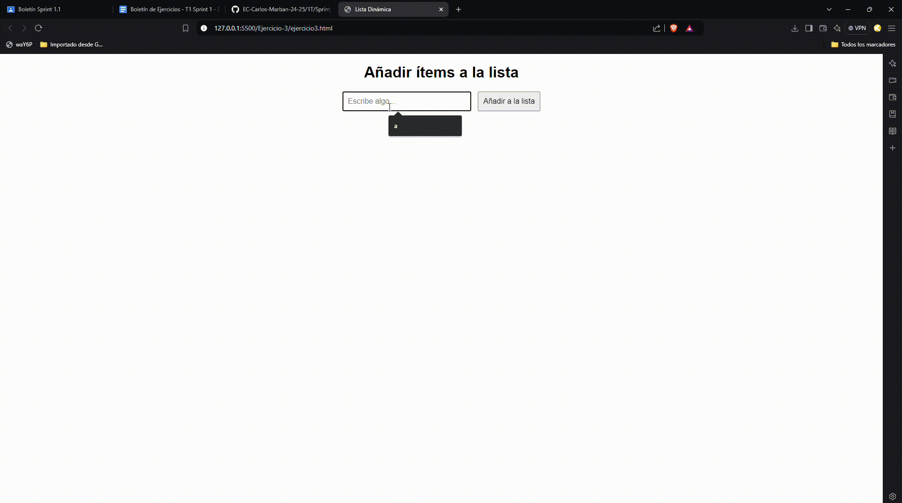

# Ejercicio 3

## Análisis del problema 

- Crea una página con un campo de entrada y un botón etiquetado "Añadir a la lista".
- También debes tener una lista vacía (`<ul>` o `<ol>`).
- Cuando el usuario escribe algo en el campo de entrada y hace clic en el botón, entonces el contenido del campo debe agregarse como un nuevo ítem (`<li>`) a la lista.

## Prueba de la resolución del problema

