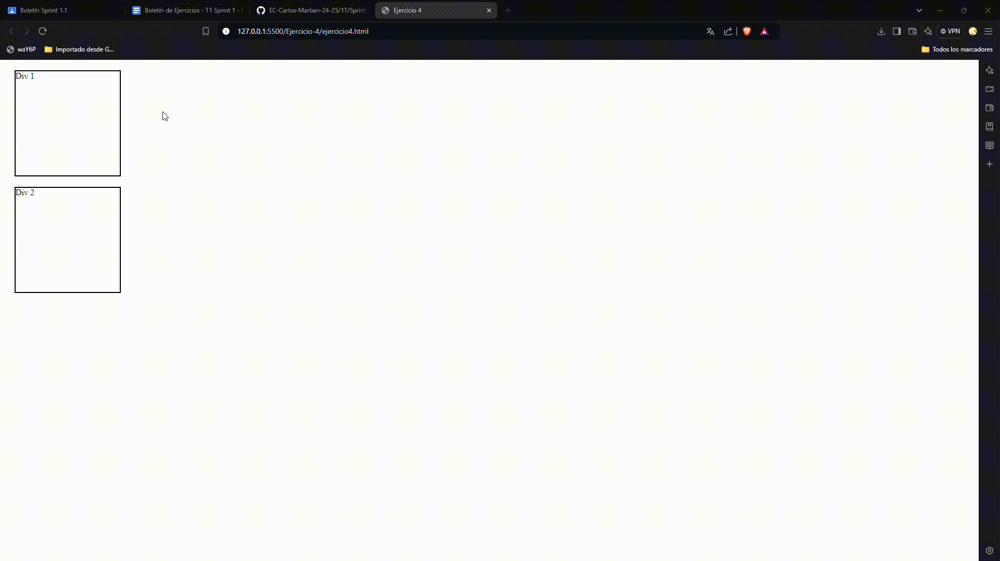

# Ejercicio 3

## Análisis del problema 

- Diseña una página con varios elementos div, cada uno con un texto diferente.
- Al pasar el ratón sobre un div, cambia su color de fondo a azul y el texto a blanco.
- Al mover el ratón fuera del div, restaura sus estilos originales.

## Prueba de la resolución del problema

