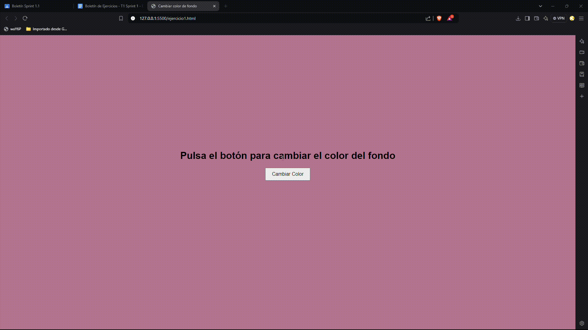
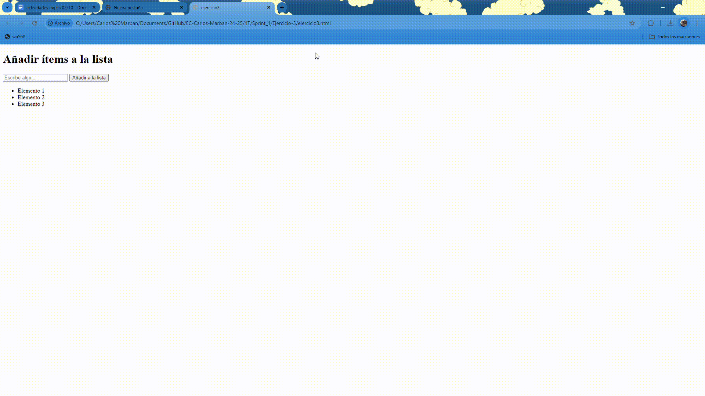
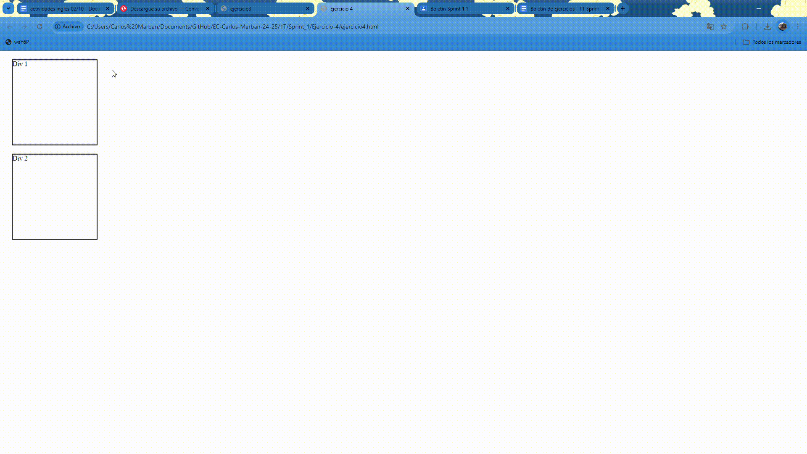

# Ejercicio 1

## Análisis del problema

- Crear una página web que contenga un botón etiquetado "Cambiar color".

- Al hacer clic en el botón, el color de fondo de la página debe cambiar a un color aleatorio.

- Pista: Utiliza `Math.random()` para generar valores RGB aleatorios.

## Pruebas de la resolución del prblema

# Ejercicio 2 

## Análisis del problema 

- Diseña una página web con dos campos de entrada (input) para introducir el ancho y el alto de un rectángulo.

- Agrega un botón etiquetado "Calcular Área".

- Al hacer clic en el botón, calcula el área del rectángulo y muestra el resultado en un elemento `
` en la página.

## Diseño de la propuesta de solución del problema 

function arearectangulo(ancho, alto) {
   
    const area = ancho * alto
    
    const resultado = "El área del rectángulo es: " + area
    
    return resultado 
} 

Usando esto en un archivo js aparte, haz una pagina web con dos entradas para escribir el ancho y el alto, ademas de un botón que tiene que tener de id "Calcular Área".

## Prueba de la resolución del problema

# Ejercicio 3

## Análisis del problema 

- Crea una página con un campo de entrada y un botón etiquetado "Añadir a la lista".
- También debes tener una lista vacía (`<ul>` o `<ol>`).
- Cuando el usuario escribe algo en el campo de entrada y hace clic en el botón, entonces el contenido del campo debe agregarse como un nuevo ítem (`<li>`) a la lista.

## Prueba de la resolución del problema

# Ejercicio 4

## Análisis del problema 

- Diseña una página con varios elementos div, cada uno con un texto diferente.
- Al pasar el ratón sobre un div, cambia su color de fondo a azul y el texto a blanco.
- Al mover el ratón fuera del div, restaura sus estilos originales.

## Prueba de la resolución del problema

