# Ejercicio 1 #

## Análisis del problema ##
**Descripción**: Crear un temporizador simple en el que el usuario pueda introducir una cantidad de segundos, y al hacer clic en un botón, comience la cuenta regresiva. Cuando el tiempo llegue a cero, debe mostrar un mensaje que diga "¡Tiempo finalizado!".

**HTML**: Un campo de entrada (input) para ingresar los segundos y un botón para iniciar la cuenta regresiva. Un área para mostrar el tiempo restante.

**JS**: Detectar el evento click en el botón, iniciar la cuenta regresiva y actualizar el tiempo en la página cada segundo hasta llegar a cero.

## Diseño de la propuesta de solución al problema ##

### Propuesta 1 Rellenar el campo de tiempo con el valor 2 segundos y pulsar el botón "Iniciar", verificando que el temporizador cuenta correctamente y muestra una alerta al terminar los 2 segundos. ###
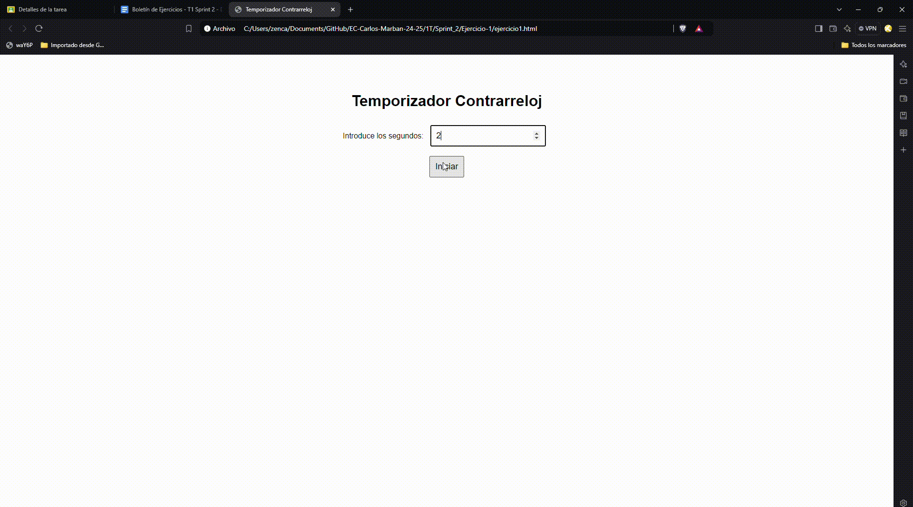
### Propuesta 2 Repetir la prueba con el valor 4 segundos, asegurándose de que el temporizador cuenta hasta los 4 segundos y que al finalizar se muestra la alerta correspondiente.
 ###
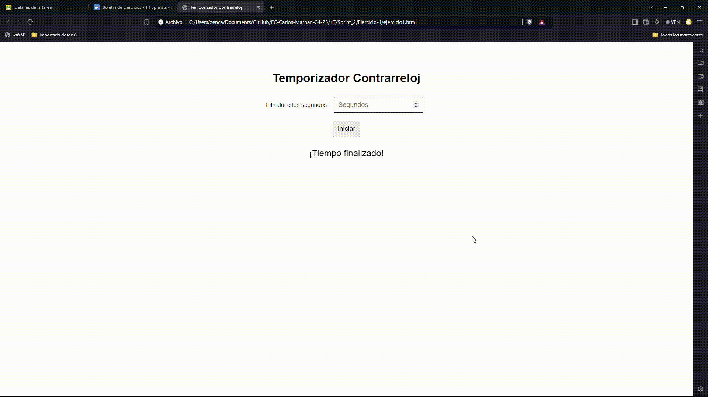

# Ejercicio 2 #

## Análisis del problema ##

**Descripción**: Crear una calculadora básica que permita realizar operaciones de suma, resta, multiplicación y división. Los usuarios deben poder introducir dos números y seleccionar una operación. Al hacer clic en "Calcular", se debe mostrar el resultado de la operación seleccionada.

**HTML**: Dos campos para introducir los números, una lista de selección (select) para elegir la operación, un botón "Calcular" y un área para mostrar el resultado.

**JS**: Detectar el evento click en el botón "Calcular", capturar los valores de los campos y realizar la operación matemática seleccionada. Mostrar el resultado en la página.

## Diseño de la propuesta de solución al problema ##

### Propuesta 1 Probar que la suma de 10 + 12 muestra correctamente el resultado de 22.
 ###
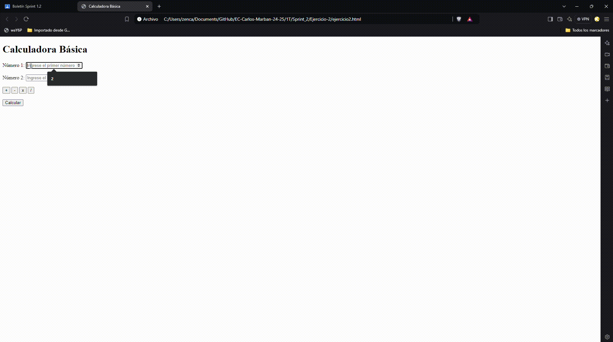
### Propuesta 2 Verificar que la resta de 10 - 12 devuelve el valor esperado de -2. ###
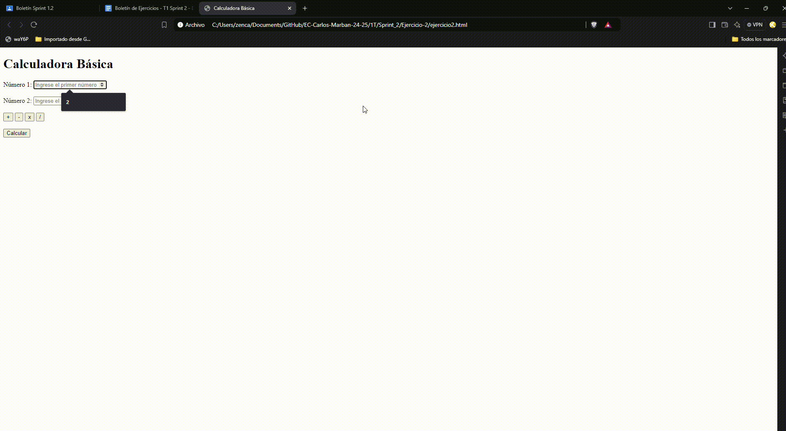

### Propuesta 3 Comprobar que la multiplicación de 5x4 es 20, y que 5x0 devuelve 0. ###
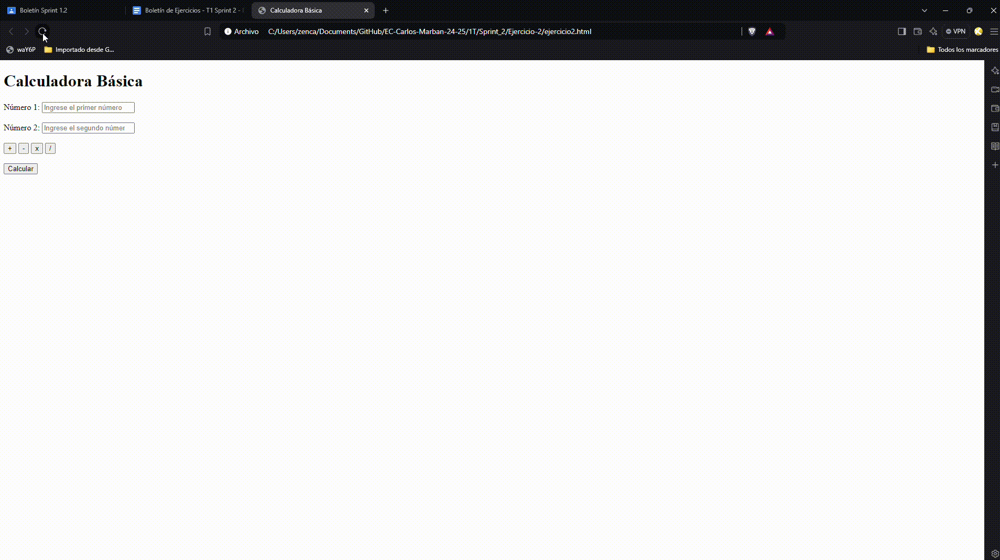

### Propuesta 4 Probar que la división de 5/4 es 1.25 y que 5/0 devuelve el mensaje "INDEFINIDO". ###
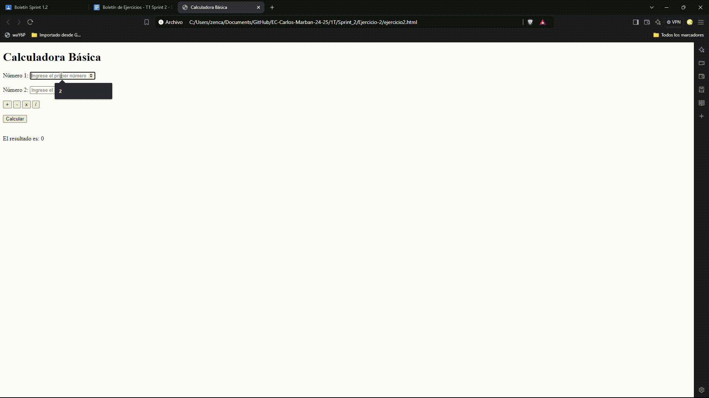

# Ejercicio 3 #

## Análisis del problema ##
**Descripción**: Crear una página con una pequeña encuesta donde el usuario puede seleccionar una opción entre varias (por ejemplo: "¿Cuál es tu color favorito?"). Al enviar la respuesta, se deben mostrar los resultados en un gráfico de barras simple que se actualice dinámicamente cada vez que se envía una respuesta.

**HTML**: Pregunta con varias opciones (utilizando radio buttons), un botón "Enviar", y un área donde se mostrará el gráfico de barras con los resultados.

**JS**: Detectar el evento click en el botón "Enviar", actualizar las respuestas seleccionadas y generar un gráfico de barras simple manipulando el DOM. El gráfico puede ser construido con divs o tablas que cambian su tamaño en función de los votos.

## Diseño de la propuesta de solución al problema ##

### Propuesta 1 Verificar que al seleccionar una opción y hacer clic en "Enviar", se actualicen correctamente los votos en el gráfico. ###
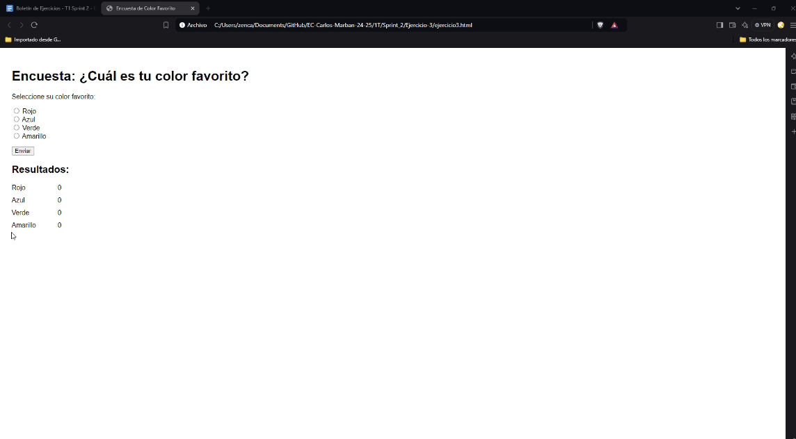
### Propuesta 2 Comprobar que el gráfico de barras se actualiza dinámicamente después de cada nueva votación. ###
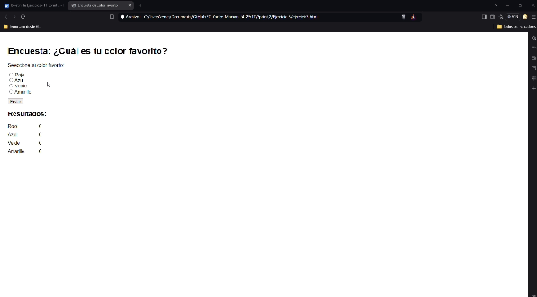

### Propuesta 3 Probar que el sistema gestiona correctamente intentos de envío sin seleccionar ninguna opción.###
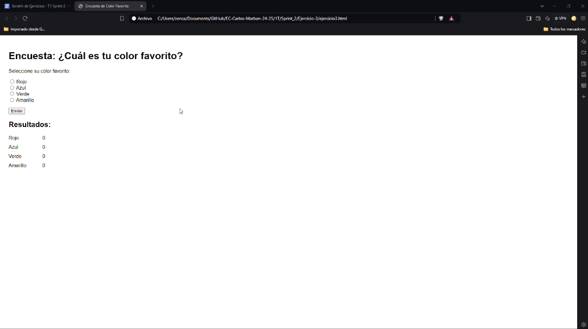

### Propuesta 4 Verificar que las votaciones previas se mantienen después de varias interacciones.###
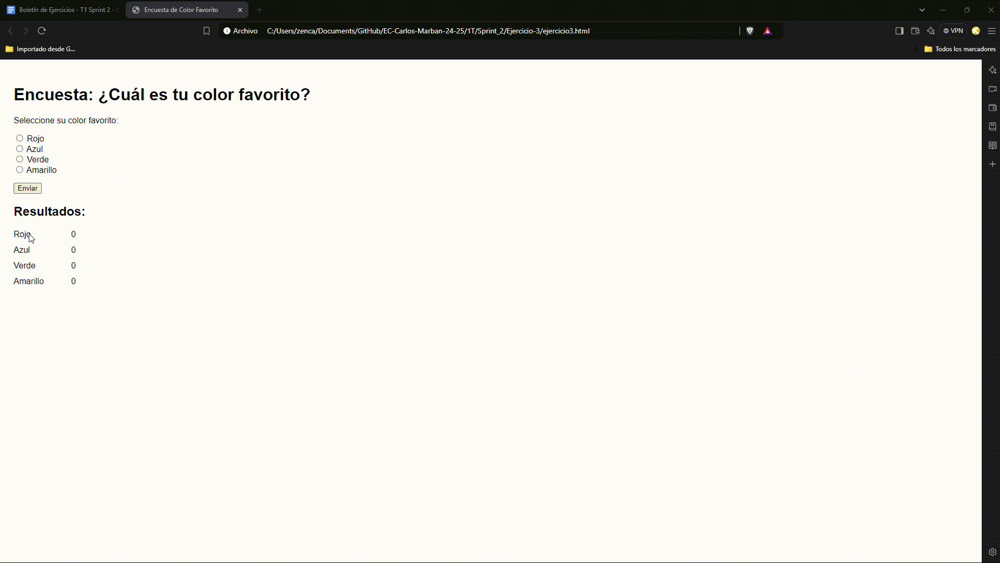

# Ejercicio 4 #

## Análisis del problema ##
**Descripción**: Crear un cronómetro que permita al usuario iniciarlo, pausarlo y reiniciarlo. El cronómetro debe actualizarse cada segundo y mostrar el tiempo en minutos y segundos.

**HTML**: Botones para "Iniciar", "Pausar" y "Reiniciar", y un área para mostrar el tiempo.

**JS**: Detectar los eventos click en los botones para iniciar el cronómetro, detenerlo y reiniciarlo. Usar setInterval para actualizar el cronómetro cada segundo.

## Diseño de la propuesta de solución al problema ##

#### Propuesta 1 Probar que el cronómetro comienza a contar correctamente al hacer clic en "Iniciar".###

### Propuesta 2 Comprobar que al pausar el cronómetro se detiene en el tiempo actual y no continúa avanzando. ###
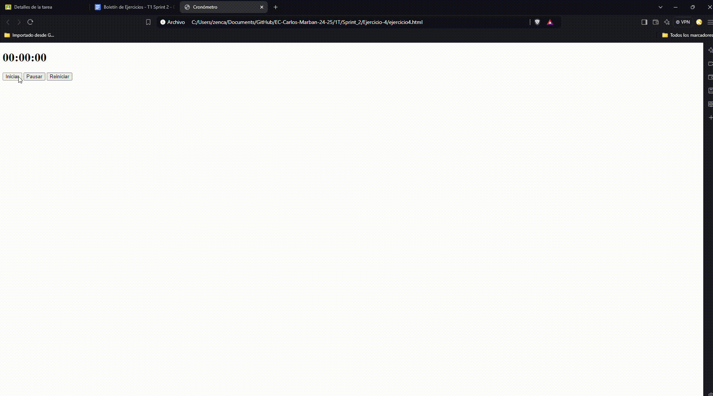

### Propuesta 3 Verificar que al hacer clic en "Reiniciar", el cronómetro vuelve a cero.###
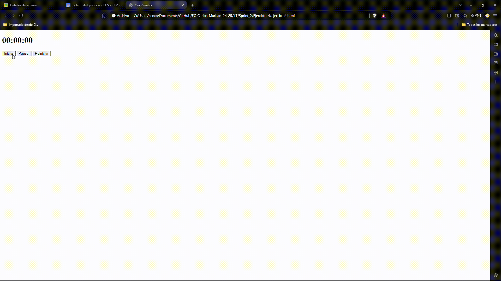

### Propuesta 4 Probar que el cronómetro maneja correctamente largos períodos de tiempo sin errores.###
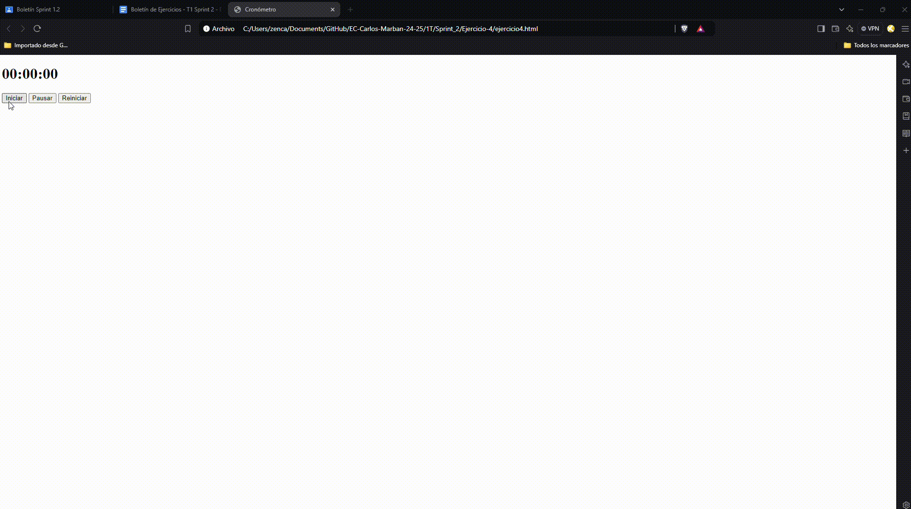

## Diseño de la propuesta de solución al problema ##

# Ejercicio 5 #

## Análisis del problema ##

**Descripción**: Crear un juego de memoria donde el usuario debe hacer clic en dos cartas para ver si coinciden. Si las cartas coinciden, permanecen boca arriba, si no, se voltean nuevamente después de un breve intervalo. El objetivo es encontrar todas las parejas de cartas.

**HTML**: Crear una cuadrícula de cartas (pueden ser imágenes o solo texto, como números o letras).

**JS**: Detectar el evento click en cada carta. Usar lógica para manejar la comparación de cartas seleccionadas, y un temporizador para voltearlas si no coinciden. Al final, mostrar un mensaje cuando el jugador haya encontrado a todas las parejas.

## Diseño de la propuesta de solución al problema ##

### Propuesta 1 Verificar que las cartas se voltean al hacer clic y se quedan volteadas si coinciden.###
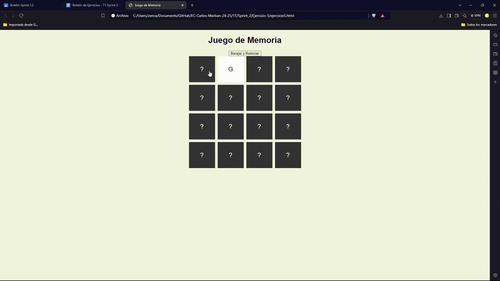
### Propuesta 2 Comprobar que dos cartas no coincidentes se voltean de nuevo después de un breve intervalo.###
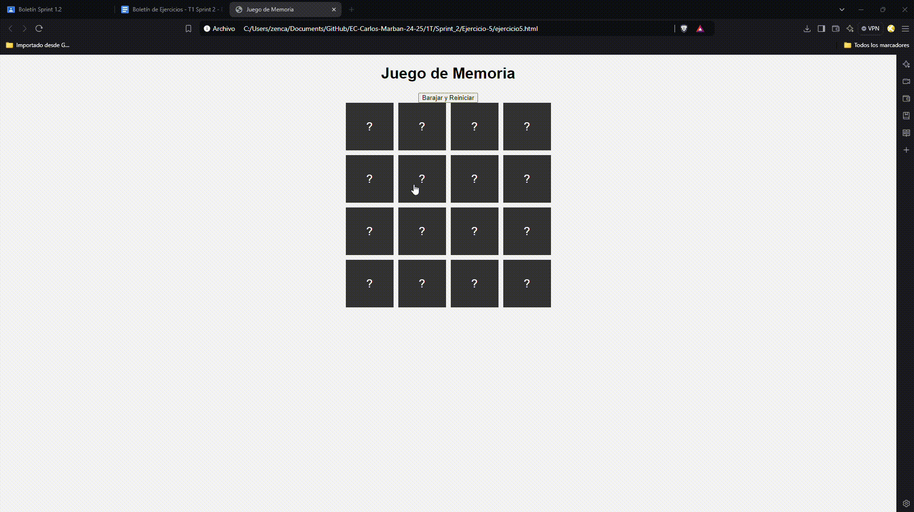

### Propuesta 3 Probar que el juego detecta cuando se han encontrado todas las parejas y muestra un mensaje de finalización. ###
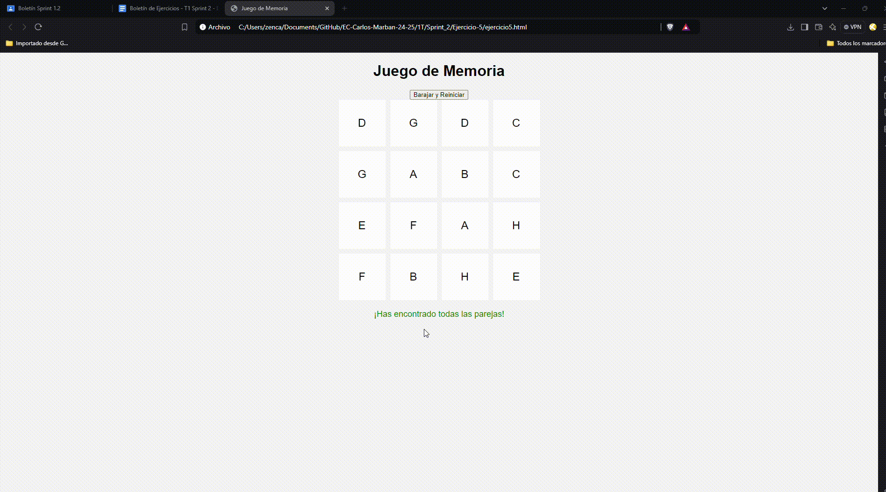

### Propuesta 4 Verificar que el juego puede reiniciarse correctamente barajando las cartas de nuevo.###
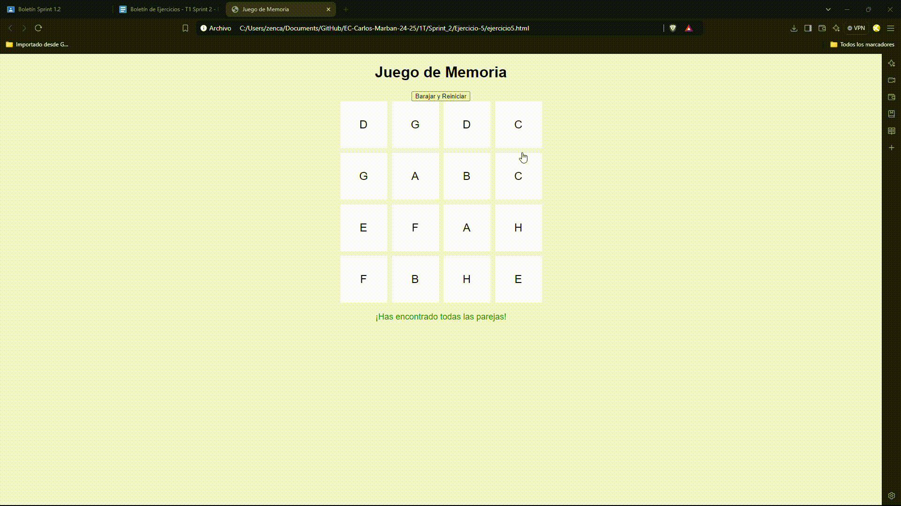
