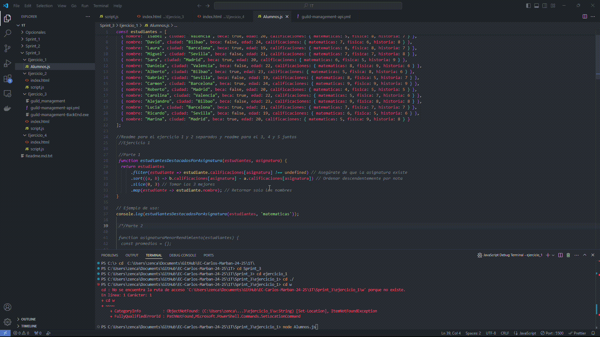
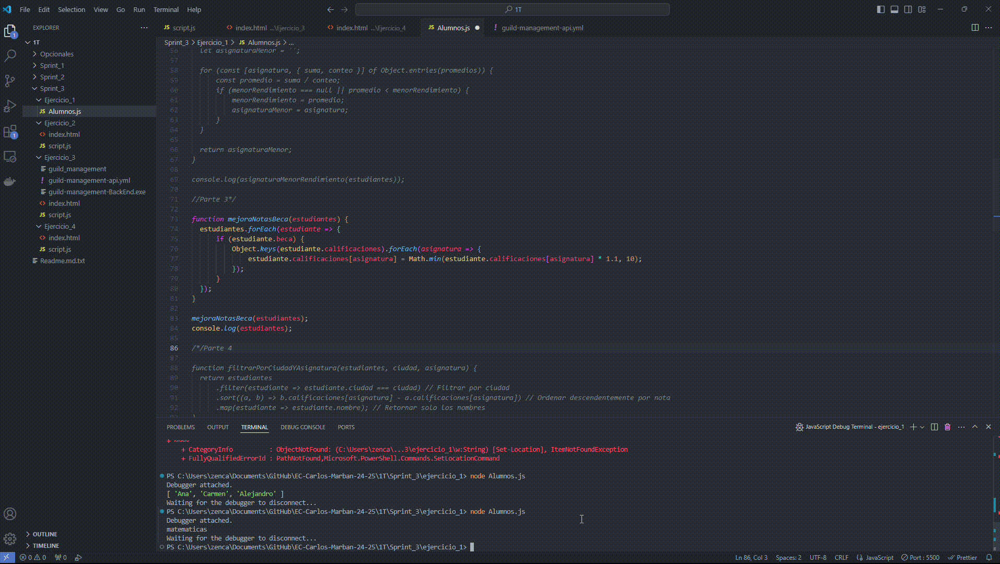
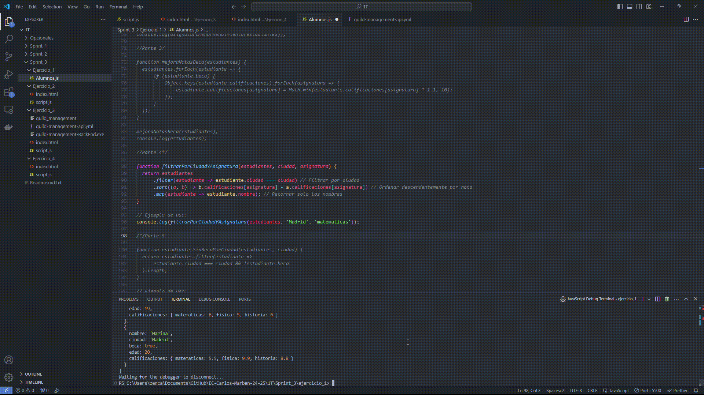
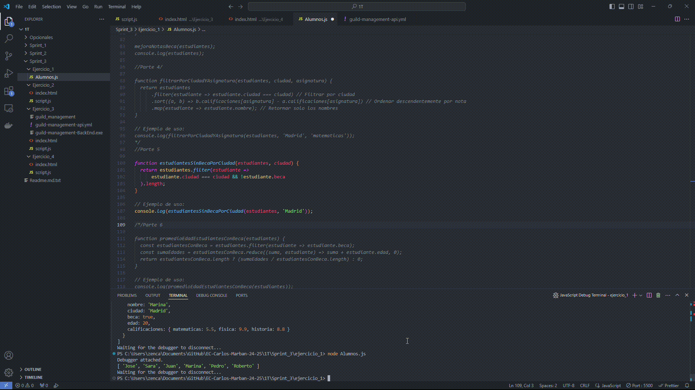
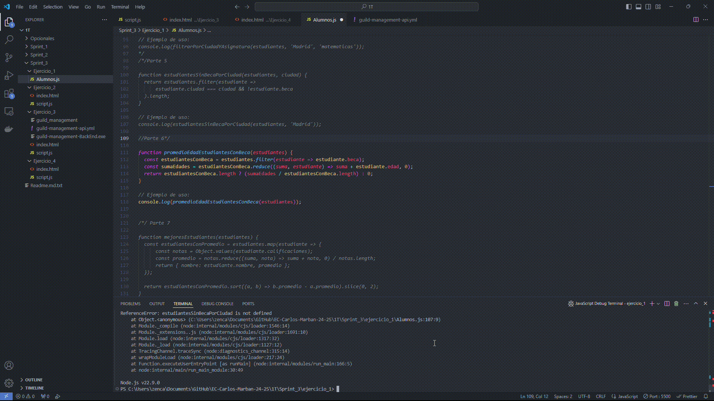
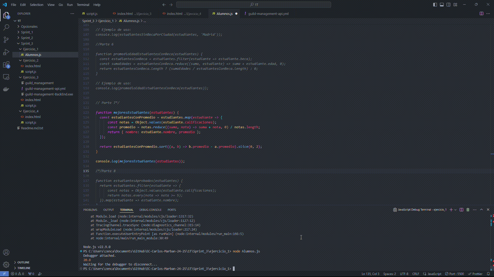
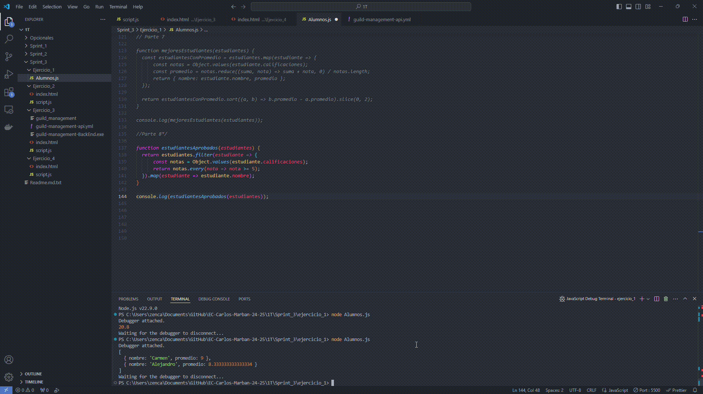

# Sprint 3 

## Ejercicio 1

### Parte 1: Estudiantes Destacados por Asignatura

### Parte 2: Asignatura con Menor Rendimiento

### Parte 3: Mejora de Notas para Estudiantes con Beca

### Parte 4: Filtrado por Ciudad y Asignatura

### Parte 5: Estudiantes Sin Beca por Ciudad

### Parte 6: Promedio de Edad de Estudiantes con Beca

### Parte 7: Mejores Estudiantes en Total

### Parte 8: Estudiantes con Todas las Materias Aprobadas

