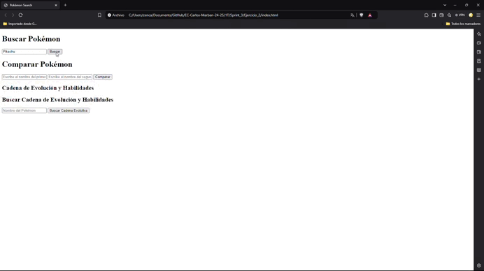
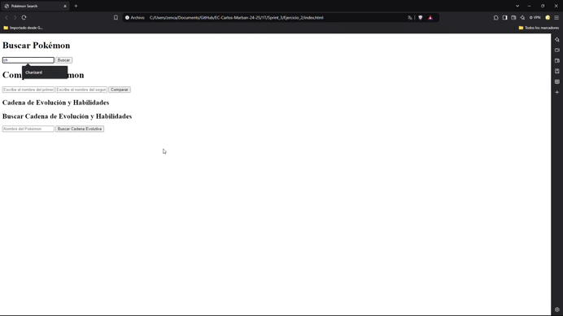
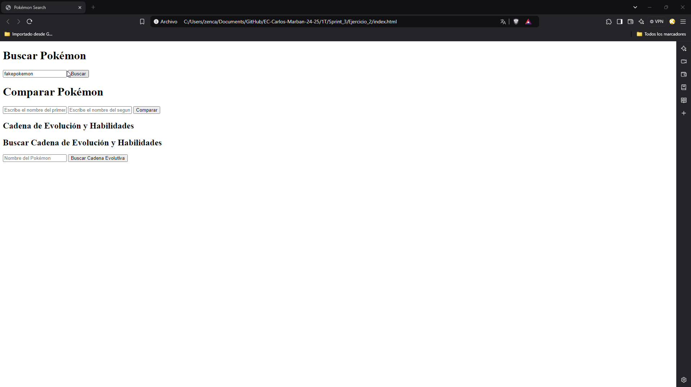
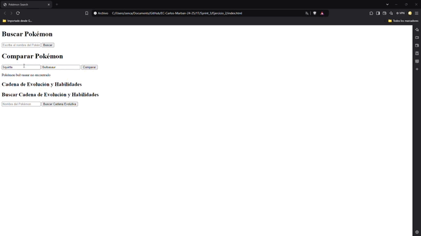
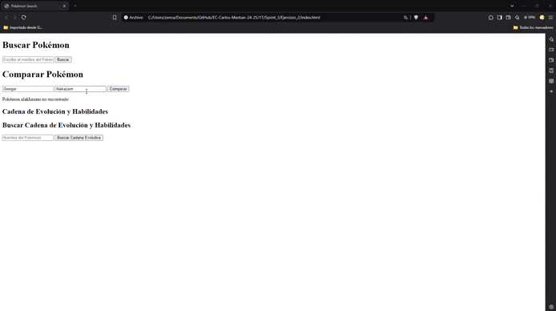
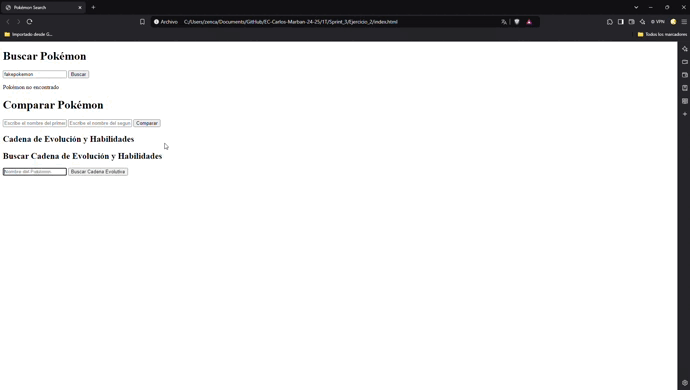
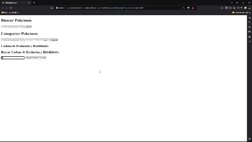

# Sprint 3
## Ejercicio 2: Uso de PokeAPI

## Parte 1

###  Prueba 1: Obtener información de "pikachu"

### Prueba 2: Obtener información de "charizard"

### Prueba 3: Manejo de error al buscar "fakepokemon"

## Parte 2 : Comparativa de Pokémon

###  Prueba 1: Comparar "bulbasaur" y "squirtle"

###  Prueba 2: Comparar "gengar" y "alakazam"

## Parte 3 : Evoluciones y Habilidades

###  Prueba 1: Obtener cadena evolutiva de "charmander"

###  Prueba 2: Manejar Pokémon sin cadena evolutiva como "tauros"

