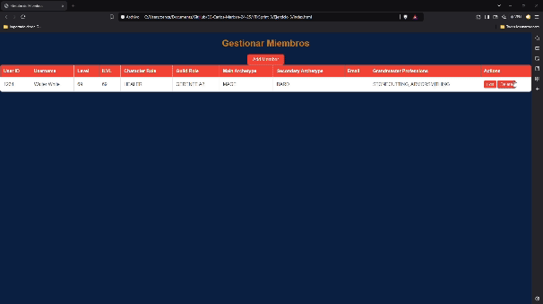
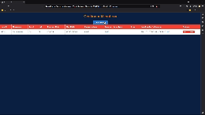
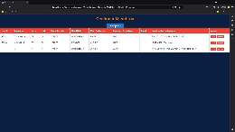
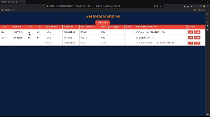
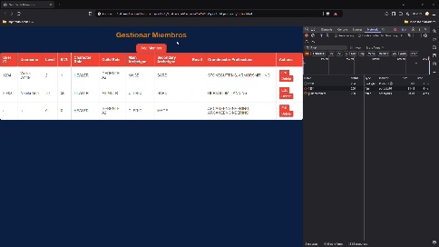
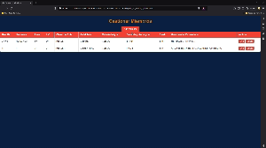
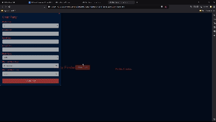
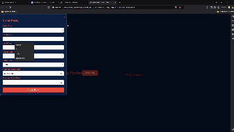
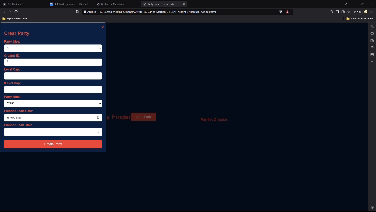
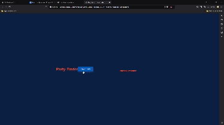

# Sprint 3

## Ejercicio 3: Implementación de CRUD con Modal para "Add New Member" en una Guild

### Prueba 1: Visualización de Miembros:

### Prueba 2: Añadir Nuevo Miembro:

### Prueba 3: Valoraciones erróneas de Añadir Miembro:

### Prueba 4: Editar Miembro:

### Prueba 5: Eliminar Miembro:

    
### Prueba 6: Comportamiento del Modal:

## Ejercicio 4: Implementación de un Formulario de Creación de Party en "Party Finder"

### Prueba 1: Crear una Party Correctamente:

### Prueba 2: Validación de Campos Vacíos:

### Prueba 3: Validación de Fecha Inválida:

### Prueba 4: Validación de Números Negativos en Caps:

### Prueba 5: Comportamiento del Formulario:

