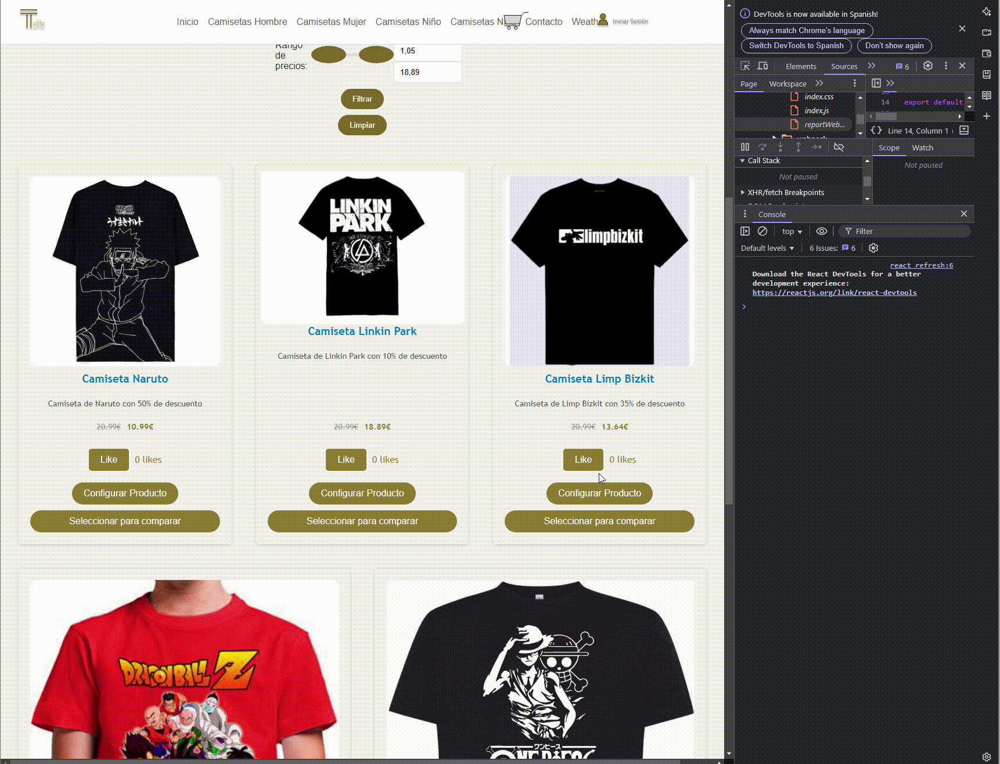

# Proyecto de Resolución de Problemas

## Análisis del Problema

En el directorio específico de la asignatura, se debe resolver el problema de crear una aplicación web de comercio electrónico que permita a los usuarios registrarse, iniciar sesión, navegar por productos, filtrar productos por nombre y rango de precios, agregar productos al carrito y realizar compras. El problema debe ser abordado de manera clara y sin ambigüedades, asegurando que todos los requisitos estén bien definidos y comprendidos.

## Diseño de la Propuesta de Solución del Problema

Para resolver el problema, se ha diseñado una solución utilizando herramientas de esquemas gráficos como UML y diagramas de flujo. A continuación se presentan los diagramas utilizados:

1. **Diagrama de Casos de Uso**: Describe las interacciones entre los usuarios y el sistema.
2. **Diagrama de Clases**: Muestra la estructura de las clases y sus relaciones.
3. **Diagrama de Secuencia**: Ilustra el flujo de interacción entre los componentes del sistema.
4. **Diagrama de Flujo**: Representa el flujo de datos y las operaciones principales del sistema.

## Pruebas de la Resolución del Problema

Es indispensable realizar pruebas para verificar la integridad y correcto funcionamiento de la implementación realizada. Para ello, se comparará el comportamiento esperado del análisis del problema con la implementación. Se utilizarán pruebas unitarias y de integración para asegurar que todas las funcionalidades operen correctamente y que los usuarios puedan interactuar con el sistema sin problemas.

### Pruebas Realizadas

#### Prueba 1: Comparación de productos
- Seleccionar al menos dos productos para comparar.
- Verificar que las diferencias clave se resaltan correctamente.

#### Prueba 2: Encuestas y votaciones
- Completar una encuesta de satisfacción.
- Validar que los votos se registran correctamente y afectan la clasificación.

#### Prueba 3: Simulación de decisión de compra
- Configurar un producto utilizando distintos parámetros.
- Verificar que las recomendaciones son coherentes con la configuración elegida.

## Implementación del Diseño Propuesto

En este punto, se procede a implementar el diseño establecido en el punto anterior. La implementación se realiza utilizando React para el frontend y el mockup de product_API para el almacenamiento de datos. La estructura de carpetas del proyecto es la siguiente:

### ⚙️ Requerimientos Funcionales

1. **Consulta del tiempo actual por provincia**
   - Introducción de la ubicación en un buscador (sólo por provincia).
   - Visualización del estado actual (temperatura, condición climática y velocidad del viento).
   - Iconos dinámicos según la condición climática (soleado, nublado, lluvia, etc.).

2. **Pronóstico detallado por horas y días**
   - Representación visual de la evolución del tiempo (gráficos de temperatura, precipitaciones, etc.).
   - Predicción por días con intervalos de mañana (8:00), tarde (15:00) y noche (21:00).
   - Predicción de mínimo 48 horas, es decir, dos días posterior al actual.

### 🔗 Documentación de la API de AEMET

Para obtener los datos meteorológicos, se utilizará la API de AEMET, que proporciona información detallada sobre el clima en tiempo real y pronósticos.

#### Registro y obtención de API Key:
- Acceder a AEMET API y obtener la clave de acceso.
- Usar POSTMAN para verificar manualmente la llamada al endpoint.
- Seguir la documentación de SWAGGER:
  - Acceder a AEMET API SWAGGER para obtener toda la información relevante a volcar en Postman para verificar el correcto funcionamiento de nuestra petición.

### 🛠️ Tecnologías Recomendadas

- **React.js / Angular**: Para la implementación de componentes.
- **Axios / Fetch API**: Para las llamadas a la API de AEMET.
- **Leaflet.js**: Para la visualización de mapas meteorológicos.
- **Chart.js**: Para la representación gráfica del pronóstico.

### 🗂️ Estructura de ejemplo (no seguir a rajatabla)

├── components/
│   ├── Layout/  
│   │   ├── Navbar.jsx             # Barra de navegación global
│   │   ├── Footer.jsx             # Pie de página
│   │   ├── Sidebar.jsx            # Menú lateral opcional
│   ├── Home/  
│   │   ├── HeroSection.jsx         # Sección destacada
│   │   ├── FeaturedContent.jsx     # Contenido destacado
│   │   ├── SearchBar.jsx           # Barra de búsqueda
│   │   ├── home.css                # Estilos específicos de la página
│   ├── Product/
│   │   ├── ProductList.jsx         # Listado de productos
│   │   ├── ProductCard.jsx         # Tarjeta de producto
│   │   ├── ProductFilter.jsx       # Filtros de productos
│   │   ├── product.css             # Estilos específicos de la página
│   ├── Shared/  
│   │   ├── Button.jsx              # Botón reutilizable
│   │   ├── Modal.jsx               # Modal reutilizable
│   │   ├── NotificationSystem.jsx  # Sistema de notificaciones
│   │   ├── ValidationSystem.jsx    # Sistema de validaciones
├── services/
│   ├── apiClient.js                # Configuración de llamadas API
│   ├── productService.js           # Llamadas API para productos
│   ├── authService.js              # Servicios de autenticación
├── styles/  
│   ├── global.css                  # Estilos globales
│   ├── layout.css                  # Estilos generales de layout
├── utils/  
│   ├── formatDate.js               # Función para formateo de fechas
│   ├── localStorageHelper.js       # Manejo del almacenamiento local

### 🧪 Pruebas a Realizar

#### ✅ Prueba 1: Consulta de provincia y visualización de datos actuales
- Ingresar Sevilla en el filtro de provincia.
- Verificar que se muestra la temperatura, el estado del clima (lluvioso, soleado, o nublado) y la velocidad del viento actual.
- Verificar que se muestra la temperatura, el estado del clima (lluvioso, soleado, o nublado) y la velocidad del viento pronosticada en al menos las siguientes 48 horas.
- Ingresar Madrid en el filtro de provincia.
- Verificar que se muestra la temperatura, el estado del clima (lluvioso, soleado, o nublado) y la velocidad del viento actual.
- Verificar que se muestra la temperatura, el estado del clima (lluvioso, soleado, o nublado) y la velocidad del viento pronosticada en al menos las siguientes 48 horas.

## Diagrama de flujo de API

## Diagrama de flujo de login

## 🛒 Categoría 3: Sitio de Ventas (Salesforce / Shopify)

### ⚙️ Descripción de las funcionalidades

1. **Comparador de Productos**
   - Comparación de productos según precio, valoraciones y especificaciones técnicas.
   - Posibilidad de seleccionar múltiples productos y visualizar sus diferencias clave.

2. **Sistemas de Encuestas o Votaciones**
   - Encuestas de satisfacción post-compra o interacción de “me gusta”.
   - Votaciones para determinar los productos mejor valorados en distintas categorías o visualización de los productos con más “me gusta”.

3. **Simuladores de Decisiones/configuraciones**
   - Configuración personalizada de productos según necesidades del usuario. (colores, tuning, motor, etc..)
   - Recomendaciones de productos con base en preferencias seleccionadas.

### 🧪 Pruebas a realizar

#### ✅ Prueba 1: Comparación de productos
- Seleccionar al menos dos productos para comparar.
- Verificar que las diferencias clave se resaltan correctamente.

#### ✅ Prueba 2: Encuestas y votaciones
- Completar una encuesta de satisfacción.
- Validar que los votos se registran correctamente y afectan la clasificación.

#### ✅ Prueba 3: Simulación de decisión de compra
- Configurar un producto utilizando distintos parámetros.
- Verificar que las recomendaciones son coherentes con la configuración elegida.

NOTA: Lo de las recomendaciones loa agregué después de hacer el gif numero 3, ya que me di cuenta de que no estaba, las recomendaciones se basan en categorias, es decir si seleccionas una camiseta de anime, te aparecen recomendaciones de camisetas de anime, si seleccionas de bandas, salen de bandas, etc.