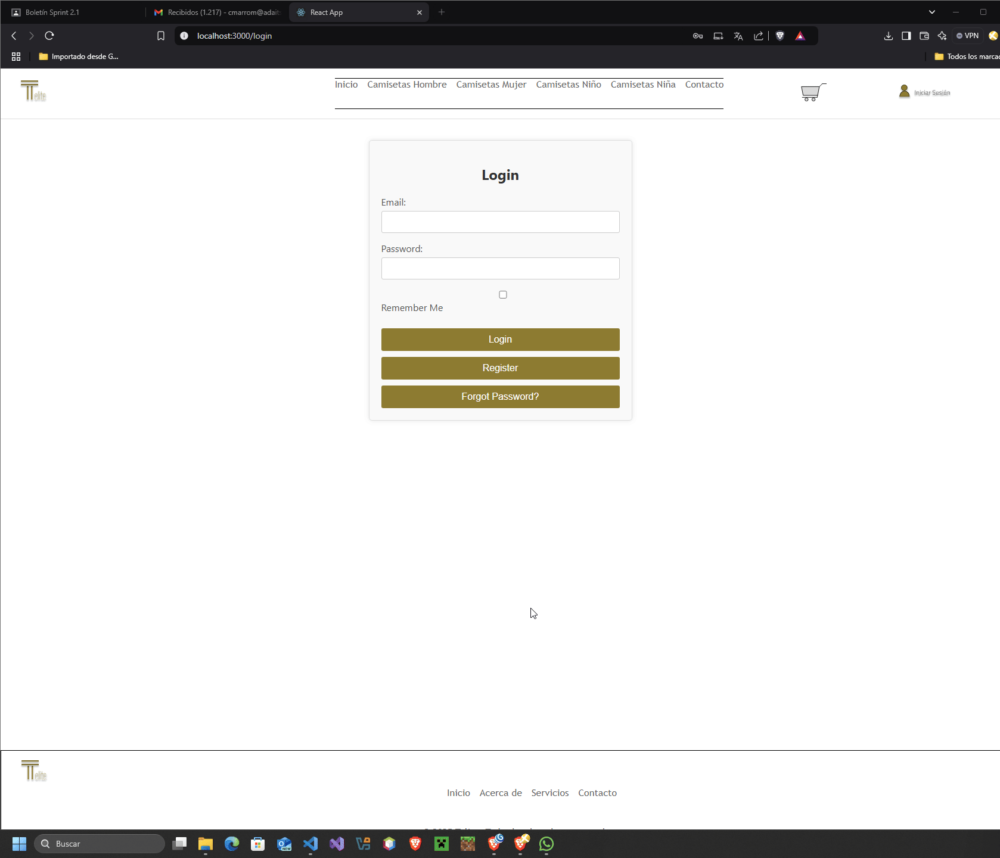
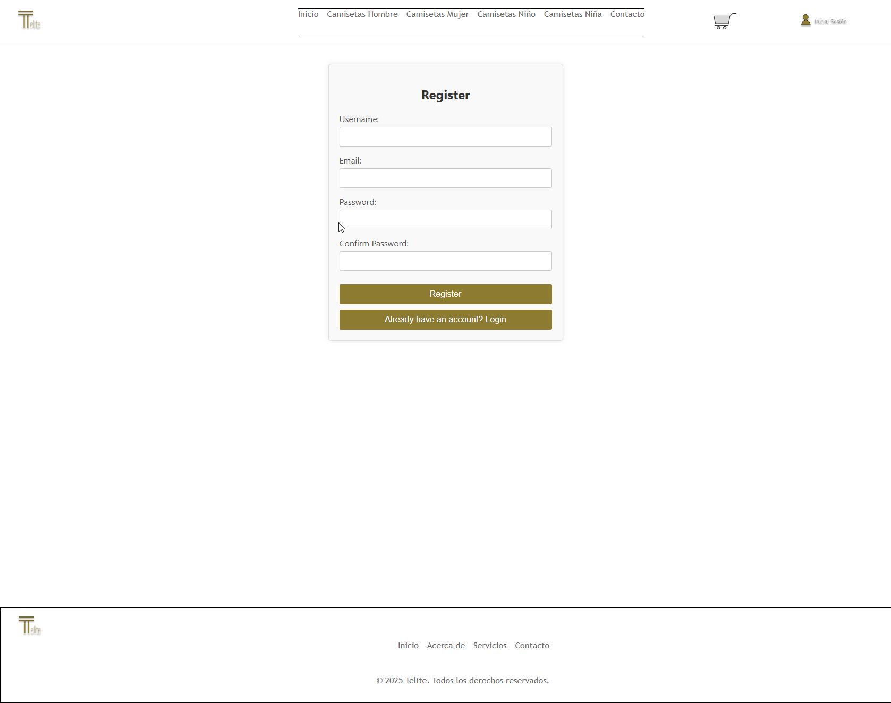
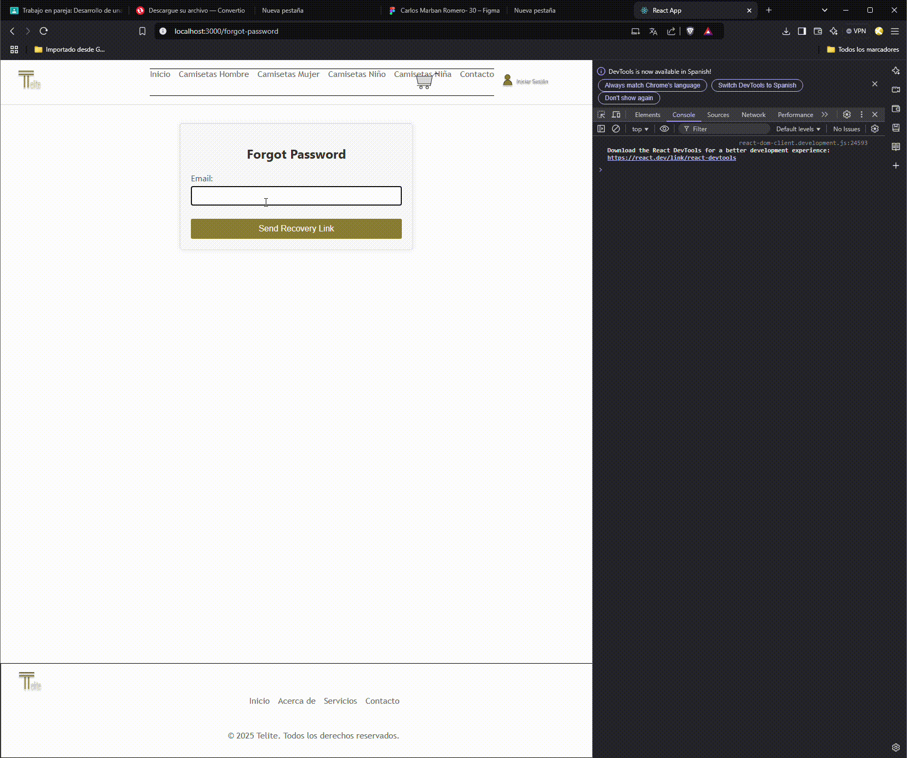

# Proyecto de Resolución de Problemas

## Análisis del Problema

En el directorio específico de la asignatura, se debe resolver el problema de crear una aplicación web de comercio electrónico que permita a los usuarios registrarse, iniciar sesión, navegar por productos, filtrar productos por nombre y rango de precios, agregar productos al carrito y realizar compras. El problema debe ser abordado de manera clara y sin ambigüedades, asegurando que todos los requisitos estén bien definidos y comprendidos.

## Diseño de la Propuesta de Solución del Problema

Para resolver el problema, se ha diseñado una solución utilizando herramientas de esquemas gráficos como UML y diagramas de flujo. A continuación se presentan los diagramas utilizados:

1. **Diagrama de Casos de Uso**: Describe las interacciones entre los usuarios y el sistema.
2. **Diagrama de Clases**: Muestra la estructura de las clases y sus relaciones.
3. **Diagrama de Secuencia**: Ilustra el flujo de interacción entre los componentes del sistema.
4. **Diagrama de Flujo**: Representa el flujo de datos y las operaciones principales del sistema.

## Implementación del Diseño Propuesto

En este punto, se procede a implementar el diseño establecido en el punto anterior. La implementación se realiza utilizando React para el frontend y localStorage para el almacenamiento de datos. La estructura de carpetas del proyecto es la siguiente:

## Estructura de carpetas
├── .gitignore
 
 ├── package.json 
 
 ├── public
 
 │ ├── assets 
 
 │ │ ├── icons 
 
 │ │ ├── images 
 
 │ │ └── products 
 
 │ ├── index.html 
 
 │ ├── manifest.json 
 
 │ └── robots.txt 
 
 ├── README.md 
 
 ├── src 
 
 │ ├── App.css 
 
 │ ├── App.js 
 
 │ ├── App.test.js 
 
 │ ├── components 

 │ │ ├── Auth 

 │ │ │ ├── ForgotPasswordForm.jsx
 
 │ │ │ ├── LoginForm.jsx 
 
 │ │ │ └── RegisterForm.jsx 
 
 │ │ ├── Home 
 
 │ │ │ ├── CartPage.jsx 
 
 │ │ │ ├── CartPreview.jsx 

 │ │ │ ├── HeroSection.jsx 
 
 │ │ │ ├── ProductCard.jsx 
 
 │ │ │ ├── ProductFilter.jsx 
 
 │ │ │ └── ProductList.jsx 
 
 │ │ ├── Layout 
 
 │ │ │ ├── Footer.jsx 
 
 │ │ │ └── NavBar.jsx 
 
 │ │ └── Shared 
 
 │ │ ├── NotificationSystem.jsx 
 
 │ │ └── ValidationSystem.jsx 
 
 │ ├── index.css 
 
 │ ├── index.js 
 
 │ ├── reportWebVitals.js 
 
 │ ├── services 

 │ │ ├── auth_API.js 

 │ │ └── product_API.js 
 
 │ ├── setupTests.js 
 
 │ └── styles
 
  │ ├── CartPage.css 
 
  │ ├── home.css 
 
  │ ├── layout.css 

  │ ├── login.css
   
  │ ├── notification.css 
  
  │ ├── products.css

  │ └── validation.css

## Pruebas de la Resolución del Problema

Es indispensable realizar pruebas para verificar la integridad y correcto funcionamiento de la implementación realizada. Para ello, se comparará el comportamiento esperado del análisis del problema con la implementación. Se utilizarán pruebas unitarias y de integración para asegurar que todas las funcionalidades operen correctamente y que los usuarios puedan interactuar con el sistema sin problemas.

### Pruebas Realizadas

## Prueba 1  Comprobación de elementos mínimos y específicos

### Navegar a la pantalla de Home.

### Comprobar que aparecen los elementos mínimos y específicos definidos anteriormente con el detalle descrito en los diferentes enumerados

## Prueba 2 : Inicio de Sesión Correcto

### Ingresar un correo y contraseña válidos.

### Hacer clic en Iniciar Sesión.

### Verificar que el usuario es redirigido al panel principal.

### Confirmar notificación de éxito.

## Prueba 3 Error en Inicio de Sesión
### Ingresar credenciales incorrectas.

### Verificar que aparece una notificación de error

## Prueba 4 : Registro con Validaciones

### Ingresar datos inválidos (correo incorrecto, contraseñas que no coinciden).

### Verificar que se muestran mensajes de error en tiempo real.

### Corregir los datos y completar el registro.

### Verificar notificación de éxito y redirección al login.

## Prueba 5 Recuperación de Contraseña

### Ingresar un correo registrado.

### Verificar que se envía un correo de recuperación.

### Probar con un correo no registrado y verificar el mensaje de error.

El resultado de las pruebas ha sido satisfactorio, confirmando que la implementación cumple con los requisitos definidos en el análisis del problema.

## NOTA: He añadido una pagina para el carrito (CartPage.jsx) y su respectivo css (CartPage.css)

## Diagrama de flujo de API

## Diagrama de flujo ed login

